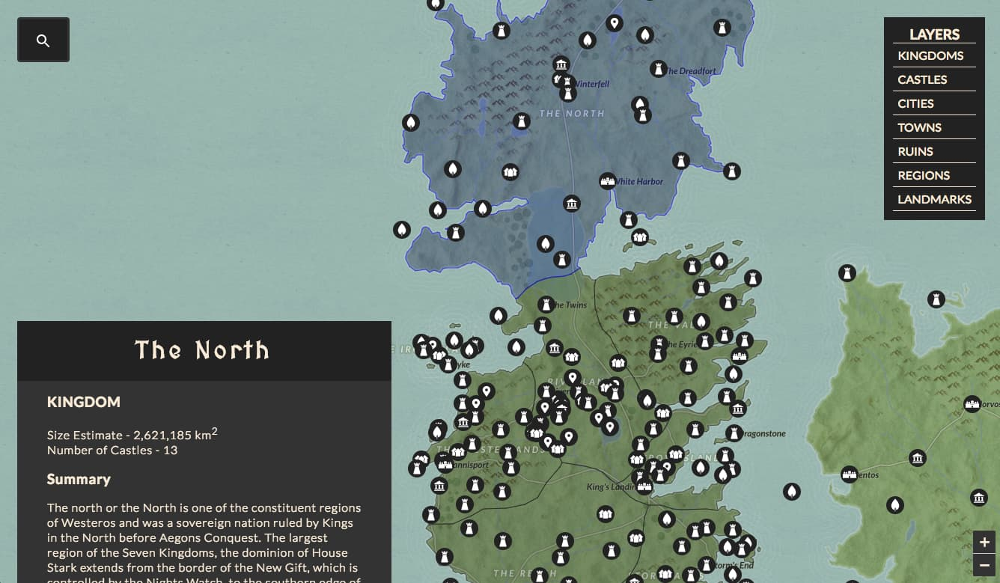

# Game of Thrones með PostgreSQL

## Leiðbeiningar

- **Öll svör verða að vera rökstudd með skýrri röksemdafærslu.** Ekki verður veitt stig fyrir svör
  án rökstuðnings.
- **Tryggið skýrleika og skipulag í uppsetningu.** Hlaðið svo upp PDF útgáfu af lausninni ykkar.
- Þetta er hópverkefni, sem fer fram hér. **Notið PR til að fara yfir lausnir hvers annars.**
  Mikilvægt er að allir séu virkir þátttakendur í sérhverju undirverkefni.
    - Tveir teymismeðlimir þurfa að samþykkja breytingar frá öðrum áður en þær eru samþykktar.
    - Ekki samþykkja án þess að skilja innihald breytinganna. Ef um er að ræða kóða, þarf að tékka
      hann út og prófa keyra.
    - Verið óhrædd við að óska eftir frekari útskýringum ef eitthvað er óskýrt.
- **Óskýr uppsetning hefur áhrif á stigagjöf verkefnisins.**
- **Mikilvægt:** Geymið **ekki** viðkvæmar upplýsingar, eins og notendanöfn og lykilorð, á GitHub.
  Notið `.gitignore` til að tryggja að slík gögn séu ekki geymd í sögunni ykkar. Ef þið gerist
  upptæk um að vista slíkar upplýsingar í Git útgáfusögunni ykkar, þá verður einkunn _umtalsvert_
  lækkuð.

---

## Viðvörun: Ekki vista lykilorð í GitHub repo

Að vista lykilorð, notendanöfn eða aðrar viðkvæmar upplýsingar í GitHub repo sem er opinber (public)
er mjög alvarlegt öryggisbrot. Hér eru nokkrar ástæður fyrir því að það má aldrei gera þetta:

1. Opnar fyrir öryggisbrot:
    - Ef lykilorð eða API lyklar eru vistuð í GitHub repo, getur hver sem er nálgast þær
      upplýsingar og misnotað þær. Þetta getur valdið því að óprúttnir aðilar fá aðgang að kerfum,
      gagnagrunnum, eða API þjónustum í þínu nafni.
2. Kostnaður:
    - Ef API lyklar eða greiðsluþjónustur eru birtar óvart í repo, getur einhver annar notað þá
      lykla til að framkvæma aðgerðir sem þú þarft svo að borga fyrir. Þetta getur valdið
      stórfelldum fjárhagslegum skaða, þar sem þú þarft að borga fyrir notkun sem einhver annar
      framkvæmdi.
3. Öryggisbrestur og erfitt að laga:
    - Þegar lykilorð eða lyklar eru vistaðir í GitHub sögunni, þá er ekki nóg að eyða bara
      skránni. Git history (útgáfusagan) heldur utan um allar breytingar, þar með talið fyrri
      útgáfur skrárinnar þar sem lykilorðin gætu enn verið til staðar. Það að fjarlægja
      viðkvæmar upplýsingar úr sögu reposins er flókið og oft er það einfaldara að eyða öllu
      repo-inu og byrja frá grunni.
4. Staða þín sem forritari:
    - Að setja viðkvæmar upplýsingar í opinbera repo getur skaðað orðspor þitt sem forritari og
      dregið úr trúverðugleika þínum hjá vinnuveitendum eða samstarfsaðilum. Það er talið
      alvarleg mistök að vista slíkar upplýsingar í opinberum kóða.

### Hvernig á að koma í veg fyrir þetta?

- **Notið `.gitignore`**: Gætið þess að búa til skrár sem innihalda lykilorð og notendanöfn
  fyrirfram í
  `.gitignore` svo þær skrár séu ekki skráðar í version control.
- **Notið umhverfisbreytur**: Lykilorð og API lyklar ættu aldrei að vera harðkóðaðir í kóðann. Notið
  í staðinn umhverfisbreytur (environment variables) eða sérstakar uppsetningarskrár sem eru ekki
  hluti af Git.
- **Tryggið aðgangsstýringar**: Ef þið notið private repo, passið að tryggja að einungis réttir
  aðilar
  hafi aðgang að því.

Ef þið hafið þegar sett viðkvæmar upplýsingar í repo, hafið strax samband við kerfisstjóra eða
admin reposins (hér er það kennari) til að fá leiðbeiningar um hvernig á að laga það.

---

## Gögn

Gögnin fyrir þetta verkefni koma frá tveimur uppruna:

1. [**Ice and Fire API**](https://anapioficeandfire.com/) - Gögn frá skáldsöguheiminum *Game of
   Thrones* (schema: `got`) sem hægt er að nálgast með API köllum á vefþjónustu eftir Joakim Skoog.
2. **Game of Maps** - Gögn um kortlagningu og staðsetningar í heimi GoT (schema: `atlas`) eftir
   Patrick Triest.

### Sjö konungsríkin

GoT heimurinn er skiptur í mörg konungsríki og svæði. Oft er rætt um hin sjö konungsríki (*the
seven kingdoms*):

1. Konungsríki Norðursins (Kingdom of the North) – Stjórnað frá _Winterfell_ af Stark ættinni.
2. Konungsríki Fjallanna og Dalsins (Kingdom of the Mountain and the Vale) – Stjórnað frá
   _Eyrie_ af Arryn ættinni.
3. Konungsríki Eyjanna og Fljótanna (Kingdom of the Isles and the Riverlands) – Sögulega sameinað
   ríki _Iron Islands_ og _Riverdale_, en nú skipt í:
    - Járneyjar (Iron Islands) – Stjórnað frá _Pyke_ af Greyjoy ættinni.
    - Árdalið (Riverlands) – Stjórnað frá _Riverrun_ af Tully ættinni.
4. Konungsríki Klapparinnar (Kingdom of the Rock) – Stjórnað frá _Casterly Rock_ af Lannister
   ættinni (líka þekkt sem
   Vesturlönd).
5. Konungsríki Stormlandanna (Kingdom of the Stormlands) – Stjórnað frá _Storm's End_ af Baratheon
   ættinni.
6. Konungsríki Frónsins (Kingdom of the Reach) – Stjórnað frá _Highgarden_  af Tyrell ættinni.
7. Furstadæmi Dorne (Principality of Dorne) – Stjórnað frá _Sunspear_ af Martell ættinni.

### Viðbótarhéruð (utan sjö konungsríkin)

Þrátt fyrir að nafnið _sjö konungsríki_ haldist, eru fleiri stór svæði í Westeros:

- Krúnulöndin (The Crownlands) – Stjórnað frá _King's Landing_, beint undir valdi Járntrónunnar.
- Vesturlöndin (The Westerlands) – Stjórnað af House Lannister (sem hluti af Kingdom of the Rock).
- Árdalið (The Riverlands) – Sérstakt hérað stjórnað af House Tully.
- Járneyjar (The Iron Islands) – Stjórnað af House Greyjoy (áður hluti af Kingdom of the Isles and
  Rivers).
- Stormlöndin (The Stormlands) – Stjórnað af House Baratheon.

### PostgreSQL tenging

Gagnagrunnurinn er hýstur á Railway og er aðgengilegur með eftirfarandi tengingarupplýsingum:

- **Host:** `junction.proxy.rlwy.net`
- **Port:** `55303`
- **Database:** `railway`
- **Username:** teymisnafn
- **Password:** uppgefið í Canvas

Teymi fá upplýsingar um notendanafn og lykilorð til að tengjast gagnagrunnum á Canvas.

Notið IDE til að tengjast PostgreSQL gagnagrunninum með þessum tengingarupplýsingum. Þið getið
notað VSCode með viðbótinni PostgreSQL. Betra er að nota IDE sem sérhæfa sig fyrir SQL en þar er
DataGrip í farabroddi (með frítt stúdentaleyfa) en DBeaver er líka góður kostur og er frjáls og
opinn hugbúnaðar.

Til að sjá hvaða töflur standa ykkur til boða getið þið keyrt eftirfarandi SQL fyrirspurn:

```sql
SELECT *
FROM pg_tables
WHERE schemaname IN ('atlas', 'got')
ORDER BY schemaname, tablename;
```

---

## Hluti 1: Ættir og landsvæði í Norður konungsríkinu

CTE (Common Table Expressions) er mikið notað í SQL en það er tímabundin tafla sem er skilgreind í
SQL fyrirspurn og er aðeins aðgengileg í þeirri fyrirspurn og öllum undirfyrirspurnum.

Hægt er að tengja saman upplýsingar frá ólíkum skemum (_schema_) innan sama gagnagrunns. Það er
líka mögulegt að tengja saman gögn frá mismunandi gagnagrunnum ef þeir eru **tengdir saman** í
sama umhverfi.

Í PostgreSQL þá er oft talað um að *upserta* sem er raunverulega skipun sem er til staðar í SQL
standardinum. Það er í raun `INSERT` skipun sem bætir við gögnum ef þau eru ekki til staðar,
annars uppfærir þau. Það er ekki gert með `UPSERT` skipun heldur með `INSERT ... ON CONFLICT ...`.

1. Skrifið SQL fyrirspurn sem finnur samsvörun á milli **ríkja** í *Game of Thrones* heiminum
   (úr `atlas.kingdoms`) og **húsum** (úr `got.houses`) út frá því hvaða hús tilheyra hvaða
   ríki. Þið skuluð sýna öll ríki og öll hús, líka þau sem eru ekki með samsvörun.
    - Upsertið möppunina í töfluna `<teymi>.tables_mapping` með dálkunum `kingdom_id`, `house_id`.
2. Skrifið SQL fyrirspurn með CTE sem finnur samsvörun á milli staða og húsa. Hér er markmiðið að
   finna **gagntæka vörpun** (one-to-one mapping), þar sem hver staður úr `atlas.locations` mappast
   á nákvæmlega eitt hús úr `got.houses`.
    - Upsertið niðurstöður fyrir allan heiminn í töfluna `<teymi>.tables_mapping` með dálkunum
      `house_id`, `location_id`.
    - Sýnið svo niðurstöður fyrir _Norðrið_.
3. Skrifið SQL fyrirspurn með CTE sem finnur stærstu ættir allra norðanmanna (þ.e. persónur sem eru
   hliðhollar húsinu *The North*). Einskorðið ykkur við ættir sem hafa fleiri en 5 hliðholla
   meðlimi. Úttakið ætti að vera raðað eftir fjölda meðlima (stærstu fyrst) og í stafrófsröð.

### Hint:

- Reynið að mappa sem flest hús við líklega staðsetningu, en þó hún sé _einkvæmt_ ákvörðuð. Það er
  ekki nauðsynlegt að finna nákvæma vörpun. Heiti hússins inniheldur oft nafnið á
  staðsetningunni, en það er ekki alltaf nóg. Þá þarf að skoða aðrar upplýsingar, eins og
  `summary` dálkinn og athuga hvort nafnið á ætt hússins kemur þar fyrir.
- Notaðu **`unnest()`** til að sundurliða `sworn_members` lista úr `got.houses`.
- Ættarnafnið er síðasta orðið í `name` dálkinum í `got.characters`.

---

## Hluti 2: Aðalpersónur í Krúnuleikum

Í SQL er **víew** *sýndartafla* sem er útkoma af SQL fyrirspurn. Það er ekki raunveruleg
gagnagrunnstafla heldur er það sýndarupplýsingar sem er hægt að nota eins og raunverulegar töflur.

Búið til **PostgreSQL** view sem heitir `lausn.v_pov_characters_human_readable` með CTE sem
inniheldur allar POV-persónur (Point of View) úr *A Song of Ice and Fire* bókunum ásamt eftirfarandi
upplýsingum:

1. Nafn með titil (ef fleiri en einn, þá velja fyrsta) sem `full_name`, kyn (`gender` sem er
   annaðhvort `M` eða `F`), nafn foreldra (`father` og `mother`) og maka (`spouse`)
   persónunnar.
2. Fæðingar- og dánarár (`born` og `died`) sem gefin eru í formatinu AC eða BC skulu
   vera gefin sem heiltölur:
    - AC árin verða jákvæðar tölur (t.d. 299 AC verður 299).
    - BC árin verða neikvæðar tölur (t.d. 3 BC verður -3).
3. Aldur persónunnar (`age`), reiknaður út frá fæðingarárinu `born` og dánarárinu `died`.
   Ef dánarár er ekki til staðar (persónan er enn á lífi), reiknið aldurinn út frá 300 AC.
4. Gefið til kynna hvort persónan sé enn á lífi eða ekki (með `alive` flag og er tvíundarbreyta).
5. Skilaðu lista yfir bókaheiti sem persónan kemur fyrir í, í réttri röð eftir útgáfuárum.

Búið til SQL **SELECT skipun** sem sýnir upplýsingar fyrir allar POV-persónur úr viewinu og
raðið eftir þeim sem eru enn á lífi, svo eftir aldri í lækkandi röð.

### Hint:

1. Allar töflur sem þið þurfið er í `got` schema.
2. **`regexp_match()`** hjálpar við að finna árin í formatinu `299 AC` eða `3 BC`. Notið `CASE` til
   að breyta `AC` í jákvæðar tölur og `BC` í neikvæðar.
3. **`COALESCE()`** hjálpar við að reikna aldur þeirra sem enn eru á lífi með því að nota dánarár
   eða sjálfgefið 300 AC.
4. Notið **`GROUP BY`** til að hópa persónur ásamt upplýsingum um foreldra og maka, og bækur sem
   persónan kemur fyrir í, þá er hægt að nota `ARRAY_AGG()` til að búa til lista af bókum.
5. Passið að útiloka ekki einstaklinga sem eru makalausir eða með óþekkta foreldra.
6. Ef þið viljið breyta viewinu ykkar, þá þarf annaðhvort að *eyða* fyrst og búa til aftur, eða
   *yfirskrifa* með viðbættu `OR REPLACE` í skipanalínunni.
7. Í lokinn getið þið farið í IDE og valið viewið, hægrismellt og valið *SQL Scripts > SQL
   Generator*
   til að fá SQL kóða sem býr til viewið. Munið að uppfæra schemað ef þið notið þessa leið.

---

## Hluti 3: PostGIS og föll í PostgreSQL

PostGIS er viðbót fyrir PostgreSQL sem bætir við geospatial gagnagrunnsföllum og aðgerðum. Í
þessum lið verður farið yfir einfalda notkun á PostGIS. Á grunninum er uppsett PostGIS version 3.
4.2, hægt er lesa documentation á [PostGIS.net](https://postgis.net/docs/manual-3.4/).

PostgreSQL með PostGIS gerir okkur leyft að geym það sérhæfðar gagnagrunnstöflur og föll til að
vinna með geospatial gögn. Það er hægt að skilgreina svæði (e. polygons) og punkta (e. points)
og nota svo föll til að vinna með þau. Finna hvar punktar eru innan svæðis, reikna fjarlægðir, og
fleira
því um líkt.

Í næstu lotu munum við svo halda áfram með þessi föll og gagnagrunnstöflur til að plotta
interactive kort, sem lítur einhvern veginn svona:



### 1. Flatarmáls konungsríkja

- Búið til PostgreSQL function `<teymi>.get_kingdom_size(int kingdom_id)` sem reiknar út flatarmál
  konungsríkis út frá landfræðilegum gögnum. Gefið niðurstöðu í ferkílómetrum (þ.e. km²) með engum
  aukastöfum.
- Hvað gerist ef þú setur inn ólöglegt gildi fyrir `kingdom_id`? Er hægt að koma í veg fyrir það
  (þ.e.a.s. kasta villu)?
- Skrifaðu *eina* SQL fyrirspurn sem notar fallið til að finna heildar flatarmál þriðja stærsta
  konungsríkisins.

### 2. Fjöldi staðsetninga og staðsetningar af ákveðnum tegundum

Skrifaðu _eina_ SQL fyrirspurn sem finnur sjaldgæfustu staðsetningategund (`location_type`) utan
_The Seven Kingdoms_ (hér ættu einnig að koma staðir eins og í Essos, þ.e.a.s. utan Westeros),
og hvaða _heita_ staðirnir sem tilheyra þeirri tegund?

